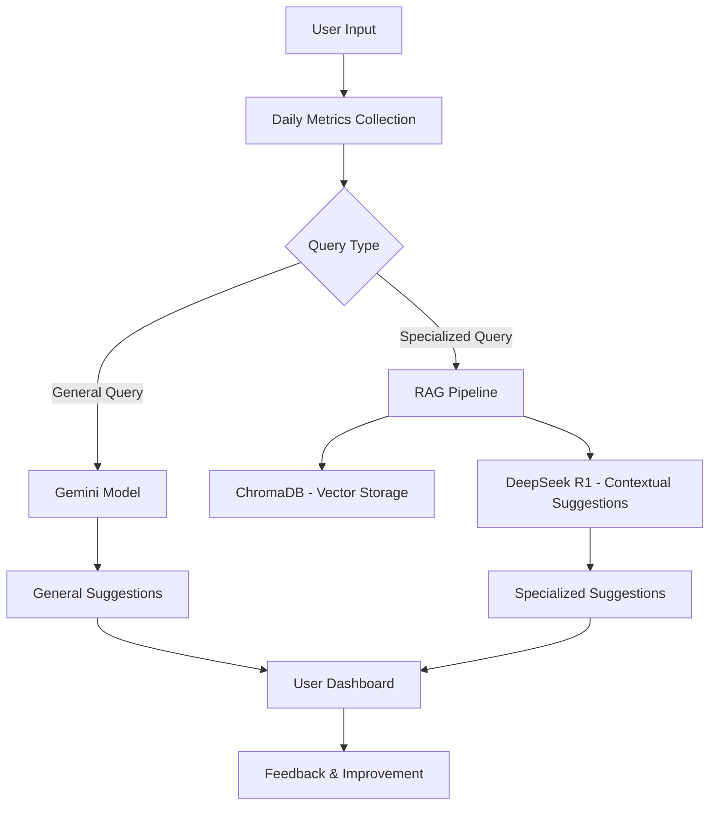

# Ashroy - Mental Health Assistant 🌱

Ashroy is a web-based mental health assistant that helps users track their daily psychological metrics and provides personalized mental health suggestions. It uses **Gemini** for general suggestions and a specialized bot powered by a **RAG pipeline** (using **ChromaDB** and **DeepSeek R1**) for context-aware, specialized advice. Built with the **MERN stack**, Ashroy aims to make mental health support accessible and personalized.

## Features ✨

- **Daily Psychological Metrics Tracking**: Users can input daily mental health metrics (e.g., mood, stress levels, sleep quality).
- **AI-Powered Suggestions**:
  - **Gemini**: Provides general mental health suggestions based on daily inputs.
  - **Specialized Bot**: Uses a RAG pipeline with ChromaDB and DeepSeek R1 to provide context-aware suggestions based on medical articles and user history.
- **Personalized Insights**: Tailored suggestions based on user input history and preferences.
- **Secure and Private**: Ensures user data is encrypted and anonymized.
- **User-Friendly Interface**: Simple and intuitive design for seamless user experience.

## Workflow 📊

Below is a high-level workflow of Ashroy:



## Tech Stack 🛠️

- **Frontend**: React.js
- **Backend**: Node.js, Express.js
- **Database**: MongoDB
- **AI Models**:
  - Gemini for general suggestions
  - DeepSeek R1 for specialized suggestions
- **Vector Database**: ChromaDB
- **Other Tools**: Mermaid.js (for diagrams), JWT (for authentication), Axios (for API calls)

## Installation and Setup 🚀

### Prerequisites

- Node.js (v16 or higher)
- MongoDB Atlas or local MongoDB instance
- Python (for ChromaDB setup, if required)
- API keys for Gemini and DeepSeek R1 (if applicable)

### Steps

1. **Clone the Repository**:
   ```bash
   git clone https://github.com/your-username/ashroy.git
   cd ashroy
   ```

2. **Install Dependencies**:
   ```bash
   # Install server dependencies
   cd server
   npm install

   # Install client dependencies
   cd ../client
   npm install
   ```

3. **Set Up Environment Variables**:
   
   Create a `.env` file in the server directory:
   ```env
   MONGO_URI=your_mongodb_connection_string
   JWT_SECRET=your_jwt_secret_key
   GEMINI_API_KEY=your_gemini_api_key
   DEEPSEEK_API_KEY=your_deepseek_api_key
   ```

4. **Run the Application**:
   ```bash
   # Start the server
   cd server
   npm start

   # Start the client
   cd ../client
   npm start
   ```

5. **Access the Application**:
   
   Open your browser and go to http://localhost:3000

## Screenshots 🖼️

[Add your screenshots here]

- Dashboard
- Metrics Input
- Suggestions

## Contributing 🤝

We welcome contributions! If you'd like to contribute to Ashroy, please follow these steps:

1. Fork the repository
2. Create a new branch (`git checkout -b feature/YourFeatureName`)
3. Commit your changes (`git commit -m 'Add some feature'`)
4. Push to the branch (`git push origin feature/YourFeatureName`)
5. Open a pull request

## License 📄

This project is licensed under the MIT License. See the LICENSE file for details.

## Acknowledgments 🙏

- Thanks to the developers of Gemini and DeepSeek R1 for their powerful AI models
- Special thanks to the open-source community for tools like ChromaDB, React, and Node.js

## Contact 📧

- Email: your-email@example.com
- GitHub: your-username
- Project Link: [Ashroy](https://github.com/your-username/ashroy)
