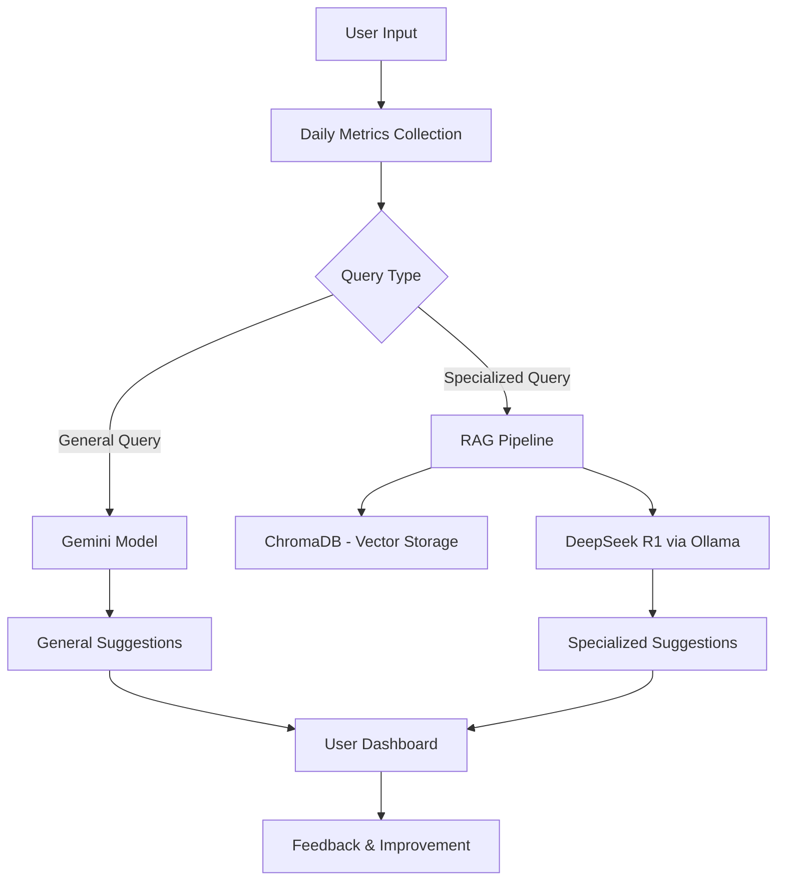

# Ashroy - Mental Health Assistant 🌱

Ashroy is a web-based mental health assistant that helps users track their daily psychological metrics and provides personalized mental health suggestions. It uses **Gemini** for general suggestions and a specialized bot powered by a **RAG pipeline** (using **ChromaDB** and **DeepSeek R1** via **Ollama**) for context-aware, specialized advice. Built with the **MERN stack**, Ashroy aims to make mental health support accessible and personalized.

## Features ✨

- **Daily Psychological Metrics Tracking**: Users can input daily mental health metrics (e.g., mood, stress levels, sleep quality).
- **AI-Powered Suggestions**:
  - **Gemini**: Provides general mental health suggestions based on daily inputs.
  - **Specialized Bot**: Uses a RAG pipeline with ChromaDB and DeepSeek R1 (running locally via Ollama) to provide context-aware suggestions based on medical articles and user history.
- **Personalized Insights**: Tailored suggestions based on user input history and preferences.
- **Secure and Private**: Ensures user data is encrypted and anonymized.
- **User-Friendly Interface**: Simple and intuitive design for seamless user experience.

## Workflow 📊

Below is a high-level workflow of Ashroy:



## Tech Stack 🛠️

- **Frontend**: React.js
- **Backend**: Node.js, Express.js
- **Database**: MongoDB
- **AI Models**:
  - Gemini for general suggestions
  - DeepSeek R1 running locally via Ollama
- **Vector Database**: ChromaDB
- **Other Tools**: Mermaid.js (for diagrams), JWT (for authentication), Axios (for API calls)

## Installation and Setup 🚀

### Prerequisites

- Node.js (v16 or higher)
- MongoDB Atlas or local MongoDB instance
- Python (for ChromaDB setup, if required)
- Ollama installed for running DeepSeek R1 locally
- API key for Gemini

### Steps

1. **Clone the Repository**:
   ```bash
   git clone https://github.com/your-username/ashroy.git
   cd ashroy
   ```

2. **Install Dependencies**:
   ```bash
   # Install server dependencies
   cd server
   npm install

   # Install client dependencies
   cd ../client
   npm install
   ```

3. **Set Up Ollama and DeepSeek**:
   ```bash
   # Pull the DeepSeek model
   ollama pull deepseek-coder

   # Verify the model is working
   ollama run deepseek-coder
   ```

4. **Set Up Environment Variables**:
   
   Create a `.env` file in the server directory:
   ```env
   MONGO_URI=your_mongodb_connection_string
   JWT_SECRET=your_jwt_secret_key
   GEMINI_API_KEY=your_gemini_api_key
   OLLAMA_API_URL=http://localhost:11434/api
   ```

5. **Run the Application**:
   ```bash
   # Start the server
   cd server
   npm start

   # Start the client
   cd ../client
   npm start
   ```

6. **Access the Application**:
   
   Open your browser and go to http://localhost:3000

## Screenshots 🖼️


## Contact 📧

- Email: bsse1303@iit.du.ac.bd
- GitHub: 2753Farhan
